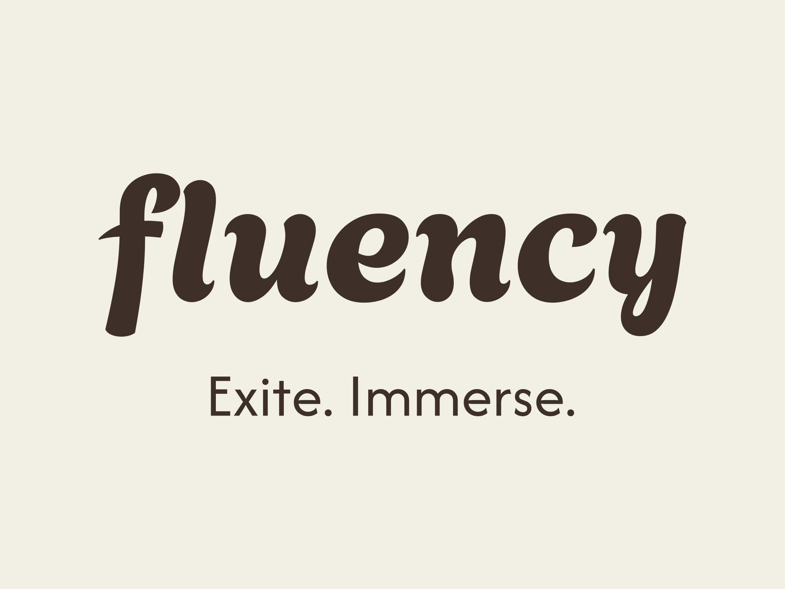
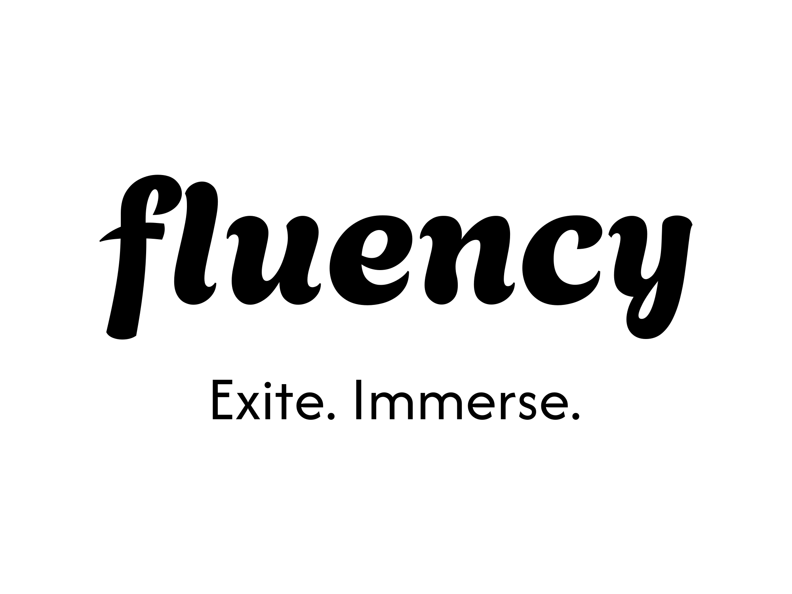
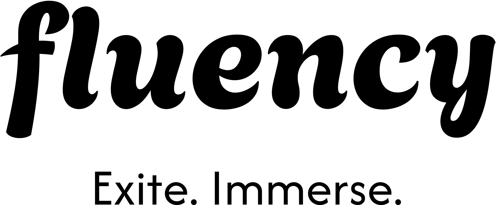

# Brand

We’re an adventurous brand that prioritizes consistency, so while we embrace a playful spirit, please keep your use of our art tasteful and send it our way for approval.

## Our Logo

Please refrain from altering, modifying, distorting, recoloring, or reconfiguring the Fluency logo in any manner.

<table>
    <tr>
        <td align="center">
            
        </td>
        <td align="center">
            
        </td>
    </tr>
</table>

## Alternate Logos

<table>
    <tr>
        <td align="center">
            
        </td>
        <td align="center">
            
        </td>
    </tr>
</table>

## Primary Fonts

- **Agbalumo**: https://fonts.google.com/specimen/Agbalumo
- **Afacad**: https://fonts.google.com/specimen/Afacad

These fonts should be used for all brand communications to maintain a consistent look and feel.

## Colors

Our brand colors are integral to our identity. Please use them consistently across all materials.

- **Primary Color**:
  - Van Dyke
  - HEX: `#3D3028`

- **Secondary Color**:
  - Copper
  - HEX: `#B66F39`

- **Neutral Color**:
  - Alabaster
  - HEX: `#F2F0E4`

Ensure that these colors are accurately represented in all digital and print materials.
